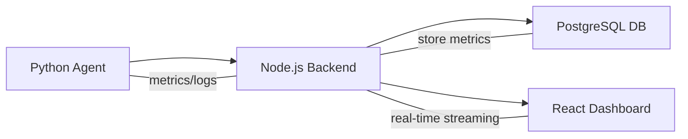

# InsightOps

**InsightOps** is a full-stack system monitoring and automation platform.  
It collects system metrics from multiple machines via a Python agent, streams them to a Node.js backend, and visualizes them in a React dashboard.

---

## Features

- **Python Agent**: Collects CPU, memory, disk, and network metrics from any machine.
- **Real-time Dashboard**: Visualize live metrics and agent status in React.
- **Secure API Keys**: Authenticate agents securely with API keys.
- **Project Management**: Users can create multiple projects with multiple agents.
- **Remote Task Execution**: Run commands on agents and stream outputs live.
- **Database Storage**: Metrics, agents, and user data stored in PostgreSQL via Prisma ORM.

---

## Tech Stack

| Component         | Technology                           |
| ----------------- | ------------------------------------ |
| Frontend          | React, Recharts, Tailwind CSS        |
| Backend           | Node.js, Express, Prisma, PostgreSQL |
| Agent             | Python (cross-platform)              |
| Real-time Updates | Socket.io                            |
| ORM / DB          | Prisma + PostgreSQL                  |

## Architecture

The InsightOps system has three main components:

